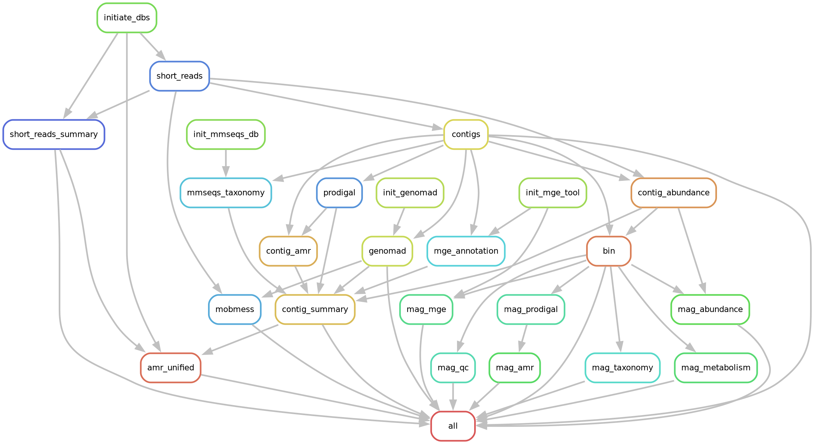

# SWAM-meta

Snakemake workflow for end-to-end metagenomic analysis of antibiotic resistance in environmental bacterial communities.

## Overview

SWAM-meta takes paired-end FASTQ files and produces a fully normalised, multi-evidence AMR abundance table alongside per-contig and per-MAG annotation outputs:

- **Short-read summaries** — AMR gene abundance (copies per genome, cpg) via KMA alignment against AMRFinderPlus, metagenomic coverage (Nonpareil), and QC metrics (fastp)
- **Assembled contigs** — de novo assembly, contig classification (chromosome / plasmid / phage), plasmid system inference (MobMess), taxonomy (MMseqs2/UniRef50), AMR (AMRFinderPlus), and MGE (MobileElementFinder) annotations joined into one TSV
- **Unified AMR table** — blends short-read sensitivity with contig-level context; cpg-normalised; evidence column tracks detection source
- **Metagenome-Assembled Genomes (MAGs)** — binning, AMR/MGE annotation, taxonomy (GTDB-tk, optional), metabolic potential (METABOLIC, optional), quality (CheckM2, optional), and relative abundance per MAG

---

## Pipeline stages

The rule dependency graph below is generated directly from `workflow/Snakefile`, so it reflects the current Snakemake DAG rather than a manually maintained stage list. It includes the optional MAG taxonomy, metabolism, and quality-control branches when those stages are enabled.

[](docs/rulegraph.png)

---

## Installation

```bash
git clone https://github.com/<org>/SWAM-meta.git
cd SWAM-meta
```

Install Snakemake and the SLURM executor plugin into your base conda environment:

```bash
conda install -c conda-forge -c bioconda "snakemake>=8" snakemake-executor-plugin-slurm
```

> **Always use `--scheduler greedy`** when running Snakemake. The default MILP scheduler requires the `cbc` solver which is not installed.

All workflow tools are installed automatically into isolated conda environments on first run via `--use-conda`.

---

## Quick start: test mode

Test mode runs the full pipeline on two synthetic mock samples using pre-built mini databases. It requires ≤ 16 GB RAM and ≤ 4 cores. No configuration changes are needed.

```bash
# 1. Dry run — validate the DAG without executing any jobs
snakemake -n --use-conda --cores 4 --scheduler greedy --config test=True

# 2. Full end-to-end test run
snakemake --use-conda --cores 4 --scheduler greedy --config test=True
```

Expected runtime: ~30–60 minutes on a laptop. Outputs are written to `test/output/`.

---

## Production setup

### 1. Add the SCG reference database

SWAM-meta ships with all database setup automated **except** the 40 single-copy gene (SCG) FASTA, which must be placed in `workflow/resources/` before first use:

```bash
cp /path/to/SCGs_40_All.fasta workflow/resources/SCGs_40_All.fasta
```

> The SCG FASTA is a curated set used to estimate genome equivalents (cpg normalisation). See `workflow/resources/README.md` for details.

### 2. Configure `config/config.yaml`

Only three paths are required. Open `config/config.yaml` and set:

```yaml
in_dir:   /path/to/fastq_files   # paired-end FASTQs (*R1*.fastq* or *_1.fastq*)
out_dir:  /path/to/output        # per-dataset analysis output directory
gtdbtk_db: ""                    # optional: path to GTDB-tk reference data
```

All other databases (AMRFinderPlus, human reference genome, anthropogenic markers, UniRef50 MMseqs2, CheckM2, METABOLIC) are **downloaded and built automatically** by SWAM-meta into `SWAM-meta/dbs/` on first run. This directory is gitignored and shared across all datasets.

**Optional databases** — downloaded only when the corresponding stage is enabled:

| Database | Triggered by | Size | Notes |
|----------|-------------|------|-------|
| AMRFinderPlus + human genome | first run | ~1.2 GB | always downloaded |
| Anthropogenic markers (pBI143, crAss001) | first run | < 1 MB | auto-fetched from NCBI |
| UniRef50 MMseqs2 taxonomy DB | first `init_mmseqs_db` | ~75 GB | 4–8 h build time |
| CheckM2 reference DB | first run with `skip_checkm2: False` | ~3 GB | auto-downloaded |
| METABOLIC | first run with `skip_metabolic: False` | ~500 MB | git-cloned |

**GTDB-tk** is the only database that must be set up manually (it has no automated installer):

```bash
conda run -n gtdbtk download-db.sh /path/to/gtdbtk_db
# then set  gtdbtk_db: /path/to/gtdbtk_db  in config/config.yaml
```

To skip optional stages entirely, set in `config/config.yaml`:

```yaml
skip_gtdbtk:   True
skip_metabolic: True
skip_checkm2:  True
```

Optional tuning:

```yaml
genomad_splits: 1     # increase (e.g. 4–8) to reduce geNomad peak memory
```

### 3. Run the workflow

```bash
# Dry run (validate DAG + config)
snakemake -n --use-conda --scheduler greedy

# Local run
snakemake --use-conda --cores <N> --scheduler greedy

# Resume after failure
snakemake --use-conda --cores <N> --scheduler greedy --rerun-incomplete

# Force re-run a specific rule
snakemake --use-conda --cores <N> --scheduler greedy --forcerun <rule_name>
```

The first run downloads and indexes the AMRFinderPlus database (~300 MB) and human reference genome (~900 MB) automatically.

---

### 4. Running on SLURM

SWAM-meta includes two SLURM profiles using [snakemake-executor-plugin-slurm](https://snakemake.github.io/snakemake-plugin-catalog/plugins/executor/slurm.html):

| Profile | Use when |
|---------|----------|
| `config/slurm/small-batch` | < 50 samples — each rule runs as its own job |
| `config/slurm/large-batch` | ≥ 50 samples — lightweight annotation rules are batched across samples |

**Step 1.** Open both profile files and fill in your cluster account and partition:

```yaml
# config/slurm/small-batch/config.yaml  (and large-batch/config.yaml)
default-resources:
  slurm_account: "my_account"
  slurm_partition: "standard"
```

**Step 2.** Submit:

```bash
snakemake --profile config/slurm/small-batch
# or
snakemake --profile config/slurm/large-batch
```

Both profiles set `scheduler: greedy`, `use-conda: true`, and all per-rule thread/memory/runtime limits. No additional flags are needed.

---

### 5. Modular execution

Use the `run_short_reads`, `run_contigs`, and `run_mags` config flags to run only the stages you need:

| `run_short_reads` | `run_contigs` | `run_mags` | What runs | External inputs required |
|:-:|:-:|:-:|---|---|
| ✅ | ✅ | ✅ | Full pipeline | None |
| ✅ | ✅ | ❌ | QC + assembly + annotation | None |
| ✅ | ❌ | ❌ | Short-reads AMR only | None |
| ❌ | ✅ | ✅ | Assembly + annotation + MAGs | `clean_reads_dir` |
| ❌ | ✅ | ❌ | Assembly + annotation | `clean_reads_dir` |
| ❌ | ❌ | ✅ | MAG binning only | `contigs_dir` + `clean_reads_dir` |

**`clean_reads_dir`** — directory with pre-filtered paired-end reads (`{sample}*R1*.fastq*` + `{sample}*R2*.fastq*`). Required when `run_short_reads: False` and any downstream stage is enabled.

**`contigs_dir`** — directory with pre-assembled contig files named `{sample}.contigs.fa`. Required when `run_contigs: False` and `run_mags: True`.

> **Note:** When `run_short_reads: False`, contig abundance is normalised to mean depth (cpg assumes n_genomes = 1) rather than true genome-equivalent copies, because SCG alignments from the short-reads stage are unavailable.

Example — run short reads + assembly only (skip MAGs):
```bash
snakemake --use-conda --cores 32 --scheduler greedy --config run_mags=False
```

Example — run MAG stage on pre-assembled contigs:
```bash
snakemake --use-conda --cores 32 --scheduler greedy \
  --config run_short_reads=False run_contigs=False \
           contigs_dir=/path/to/contigs \
           clean_reads_dir=/path/to/clean_reads
```

---

## Outputs

| Path | Description |
|------|-------------|
| `{out_dir}/fastp_summary.csv` | Per-sample fastp QC metrics + Nonpareil coverage |
| `{out_dir}/short_reads_output.csv` | AMR gene abundances (cpg) from short-read KMA alignment |
| `{out_dir}/markers_cpg.csv` | pBI143 and crAss001 cpg per sample |
| `{out_dir}/contig_summary.tsv` | Per-contig: abundance, molecule type, taxonomy, AMR genes, MGEs |
| `{out_dir}/AMR_unified.csv` | **Unified AMR table** — short-reads + contigs merged (see below) |
| `{out_dir}/AMR_abundance_summary.csv` | Per-sample: total AMR cpg (unified) + pBI143 cpg + crAss001 cpg |
| `{out_dir}/data/megahit/{sample}.contigs.fa` | Assembled contigs (headers prefixed `{sample}-`) |
| `{out_dir}/data/genomad/{sample}/` | geNomad classification output |
| `{out_dir}/data/mobmess/{sample}-mobmess_contigs.txt` | MobMess plasmid systems |
| `{out_dir}/data/bins/{sample}/.binning.done` | MetaBAT2 binning sentinel |
| `{out_dir}/data/bins/{sample}/mag_amr.tsv` | AMR genes per MAG |
| `{out_dir}/data/bins/{sample}/mag_mge.tsv` | MGEs per MAG |
| `{out_dir}/data/bins/{sample}/gtdbtk.summary.tsv` | GTDB-tk taxonomy per MAG *(if enabled)* |
| `{out_dir}/data/bins/{sample}/mag_abundance.tsv` | Trimmed-mean relative abundance per MAG |

### AMR_unified.csv columns

| Column | Description |
|--------|-------------|
| `sample` | Sample identifier |
| `gene_symbol` | AMRFinderPlus allele (join key across both streams) |
| `gene_family` | Gene family grouping |
| `product_name` | Full gene product name |
| `class` / `subclass` | AMR drug class / subclass |
| `type` / `subtype` | Feature type (AMR, STRESS, etc.) |
| `cpg` | Preferred abundance: contig cpg if assembled, else short-reads cpg |
| `evidence` | Detection source: `both`, `short_reads_only`, or `contigs_only` |
| `short_reads_cpg` | Raw KMA-derived cpg (0 if not detected) |
| `contig_cpg` | Contig-derived cpg (0 if not assembled) |
| `molecule_type` | Comma-separated molecule types from geNomad (e.g. `chromosome,plasmid`) |
| `taxonomy` | Modal contig taxonomy from MMseqs2 |
| `n_contigs` | Number of distinct contigs carrying this gene (0 for short_reads_only) |

---

## Abundance normalisation

All AMR and contig abundances are expressed in **copies per genome (cpg)**:

```
n_genomes = Σ(alignment_length / gene_length) / 40    # across 40 SCGs via DIAMOND
cpg       = mean_depth / n_genomes
```

The same `n_genomes` estimate from the SCG DIAMOND alignment is shared between short-read AMR normalisation and contig-level abundance.

**AMR_unified.csv cpg priority:** when a gene is detected by both streams, the contig cpg is used (higher specificity — derived from assembled sequence); otherwise the short-reads cpg is used (detects genes present at too low depth to assemble).

---

## Repository structure

```
config/
  config.yaml                   # user configuration (in_dir, out_dir, gtdbtk_db only)
workflow/
  Snakefile                     # entry point; defines rule all
  resources/
    SCGs_40_All.fasta           # 40 curated single-copy genes (must be added manually)
  rules/
    common.smk                  # sample discovery, test-mode overrides, resource helper
    short_reads.smk             # QC, host filtering, AMR + SCG + marker alignment
    contigs.smk                 # assembly, geNomad, MobMess, Prodigal, taxonomy, MGE, abundance
    mags.smk                    # binning, per-MAG annotation, taxonomy, metabolism, abundance
    summary.smk                 # cross-stage: AMR_unified + AMR_abundance_summary
  envs/                         # per-rule conda environment YAML files
  scripts/
    short_reads_processing.R    # AMR + marker normalisation; outputs short_reads_output.csv + markers_cpg.csv
    contig_abundance.py         # contig cpg abundance from BAM depth
    contig_summary.py           # joins geNomad, MMseqs2, AMR, MGE, abundance per sample
    amr_unified.py              # merges short-read + contig AMR; generates AMR_unified.csv + AMR_abundance_summary.csv
    detect_circular_contigs.py  # Yu et al. 2024 circularity algorithm (used by MobMess rule)
dbs/                            # auto-managed databases (gitignored; shared across datasets)
test/
  data/                         # mock FASTQ pairs (mock1, mock2) — biologically realistic
  dbs/                          # mini test databases (AMRFinderPlus subset, UniRef50 subset, etc.)
  scripts/
    generate_mock_data.py       # reproducible mock data generation script
docs/
  session-log.md                # Copilot session log
```
